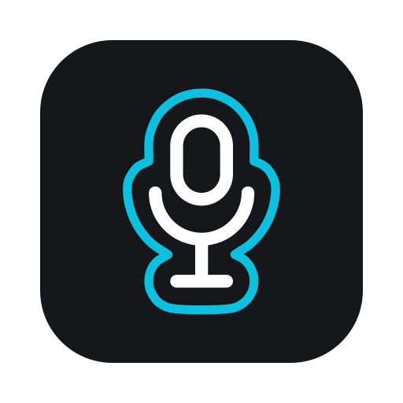

<div align="center">



# Nockerl Voice

Local-first speech-to-text for macOS. Double-tap the Right Command key, speak, and clean transcribed text lands wherever your cursor is.

[](LICENSE)
[](#requirements)

**[nockerl.ai/voice](https://nockerl.ai/voice/)** &nbsp;·&nbsp; [Download](../../releases/latest) &nbsp;·&nbsp; [Report an issue](../../issues)


</div>

---

**Contents**

[What it is](#what-it-is) &nbsp;·&nbsp;
[How you use it](#how-you-use-it) &nbsp;·&nbsp;
[Requirements](#requirements) &nbsp;·&nbsp;
[Install](#install) &nbsp;·&nbsp;
[Permissions](#permissions) &nbsp;·&nbsp;
[Uninstall](#uninstall) &nbsp;·&nbsp;
[Privacy](#privacy) &nbsp;·&nbsp;
[Build from source](#build-from-source) &nbsp;·&nbsp;
[Contributing](#contributing) &nbsp;·&nbsp;
[License](#license)

---

## What it is

Nockerl Voice is a menu-bar app, not a window you keep open. It captures your voice, transcribes it, and inserts the text into whatever app you are already using.

You choose where transcription runs:

- **Your own server.** Point it at any OpenAI-compatible transcription endpoint, such as a MiMo server on your own network. Audio stays on infrastructure you control.
- **The cloud.** Use the MiMo model on OpenRouter with your own API key. Requests use zero-data-retention routing.

One engine is active at a time and you pick it in Settings; there is no hidden fallback between them. Every dictation is also written to an on-device history, so a paste gone wrong is never a lost transcript.

## How you use it


1. **Double-tap the Right Command key** to start recording. A small heads-up display appears and shows your input level.
2. Speak.
3. **Single-tap the Right Command key** to stop. The audio is transcribed and the text is pasted at your cursor.

Press Escape while recording to cancel it. Everything else lives behind the menu-bar icon: your most recent transcripts, a searchable history, dictation styles, custom vocabulary, and Settings.

## Requirements

- macOS 14 (Sonoma) or later.
- A transcription engine, which is **either** an OpenRouter API key **or** a custom OpenAI-compatible endpoint.

Be clear-eyed about this: the app does nothing useful until one of those is set up. On first launch, open Settings, pick an engine, and paste your API key or enter your endpoint URL.

## Install

Homebrew:

```
brew tap dizyx/tap
brew install --cask nockerl-voice
```

The extra `tap` line is not optional and is not specific to this app: Homebrew requires
any third-party repository to be added explicitly before it will install from it. Apps
that install in one command live in Homebrew's own cask repository, which ships with
Homebrew itself.

Or download the notarized `.dmg` from the [latest release](../../releases/latest) and drag Nockerl Voice into your Applications folder.

Every release is built and published in the open, so you can confirm a download matches this source before you trust it:

```
gh attestation verify NockerlVoice-<version>.dmg --repo dizyx/nockerl-voice   # SLSA build provenance
shasum -a 256 -c checksums.txt                                                # checksums
spctl -a -vvv -t install /Applications/NockerlVoice.app                       # Apple notarization
```

## Permissions

Nockerl Voice needs two macOS permissions and asks for each one the first time it is needed:

- **Microphone**, to record your voice.
- **Accessibility**, for both halves of the job: pasting the transcript into the frontmost app, and the system-wide `CGEventTap` behind the Right Command hotkey, so it works no matter which app is in front.

**The app is deliberately not sandboxed.** A system-wide keyboard tap and pasting into other apps are both impossible from inside the App Sandbox, so Nockerl Voice ships without it. That is a real tradeoff and worth saying plainly: an app that can watch your keyboard deserves scrutiny. Three things are meant to earn your trust instead. The source is right here. Every release is built in public with signed provenance you can verify (see [Install](#install)). And the keyboard tap exists only to catch the Right Command hotkey and the few keys that drive the recording popup; it never records or transmits what you type.

If you point the app at a custom endpoint on your local network, macOS may also ask for the Local Network permission.

## Uninstall

Homebrew removes the app and the files it created:

```
brew uninstall --zap --cask nockerl-voice
```

Without Homebrew, drag the app to the Trash and remove these if you want them gone:

```
~/Library/Application Support/NockerlVoice     # kept audio recordings
~/Library/Logs/NockerlVoice                    # debug log
~/Library/Preferences/com.dizyx.nockerlvoice.plist
```

Your API key is in the login Keychain under `com.dizyx.nockerlvoice` and is not removed
by either route. Delete it in Keychain Access if you want it gone.

Your transcription history lives at `~/Library/Application Support/default.store`, which
is SwiftData's shared default rather than a folder named for this app. Neither the app nor
Homebrew deletes it, deliberately: another application can legitimately own that same
file, and removing it during an uninstall could take someone else's data with it. Delete
it by hand only if you know nothing else is using it.

## Privacy

- **No accounts, no telemetry, no analytics.** Nothing about your usage is collected or phoned home.
- Your API key lives in the macOS Keychain. Your history and settings stay on your Mac.
- Raw audio is not kept by default. The text of a transcript is what gets saved to history.
- The only network requests the app makes are to the transcription engine you configured.

Automatic update checking is not shipped yet. When it arrives (via [Sparkle](https://sparkle-project.org)), the app will make a network request to check for a newer version; that behavior will be documented here before it ships.

## Build from source

You need macOS 14+, Xcode 16+, and [XcodeGen](https://github.com/yonaskolb/XcodeGen) (`brew install xcodegen`).

The interface is built on the [NockerlDesign](https://github.com/dizyx/nockerl-design) Swift package. Generate the Xcode project and open it:

```
xcodegen generate
open NockerlVoice.xcodeproj
```

NockerlDesign and the MP3 encoder (swift-lame) both resolve automatically through Swift Package Manager on the first build.

## Contributing

Issues and pull requests are welcome. See [CONTRIBUTING.md](CONTRIBUTING.md) to get set up, and [SECURITY.md](SECURITY.md) to report a vulnerability privately.

## License

[MIT](LICENSE). The bundled Outfit and Space Mono typefaces are under the SIL Open Font License 1.1, and the MP3 encoder (LAME) is LGPL. See [THIRD-PARTY-LICENSES.md](THIRD-PARTY-LICENSES.md) for the full third-party notices.
